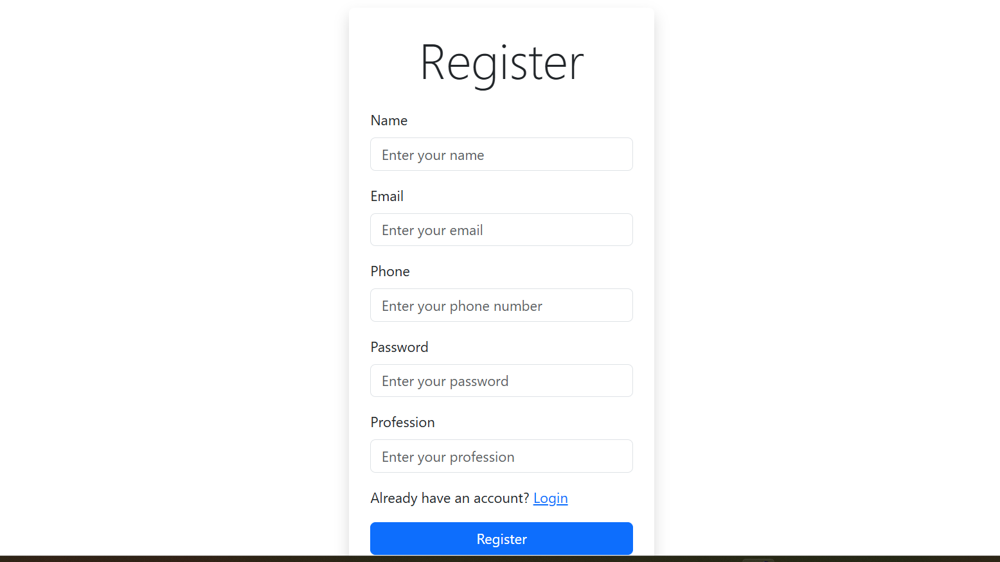
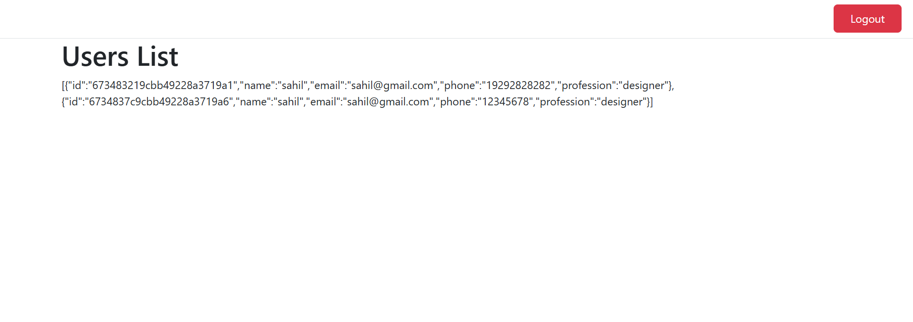

## API Reference

#### Get all items
## Hosted link  !
[Geeks Energy](https://geeksenergy-frontend-6izc.vercel.app/Login)


2024-11-13 170825.png)




```http
  POST https://geeksenergy-backend.onrender.com//api/user/register
```
```http
  POST https://geeksenergy-backend.onrender.com//api/user/Login
```
```http
  GET https://geeksenergy-backend.onrender.com//api/user/allUser
```
```http
   PUT https://geeksenergy-backend.onrender.com//api/user/updateUser
```

```http
   DELETE https://geeksenergy-backend.onrender.com//api/user/deleteUser
```


